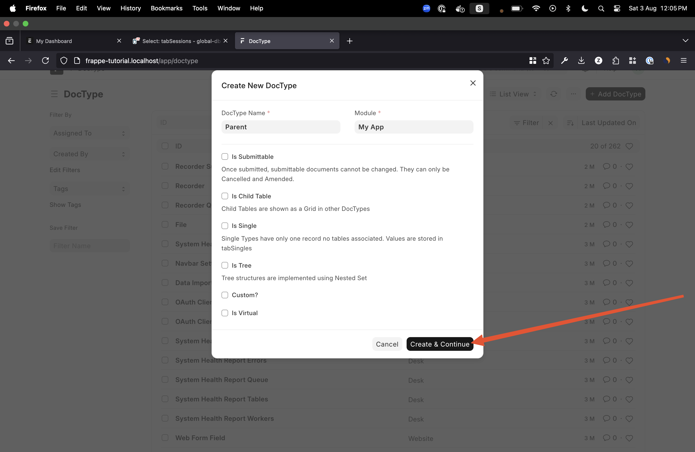
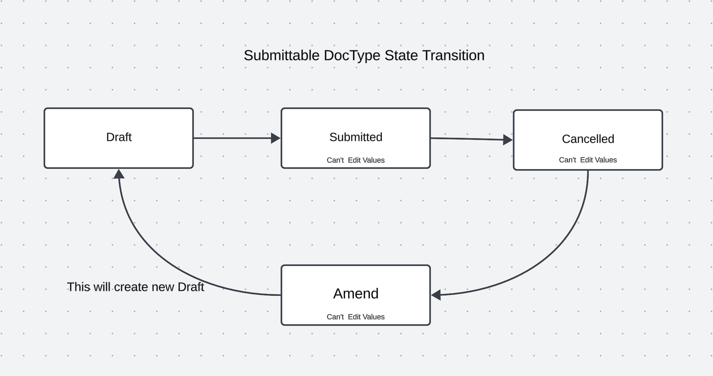
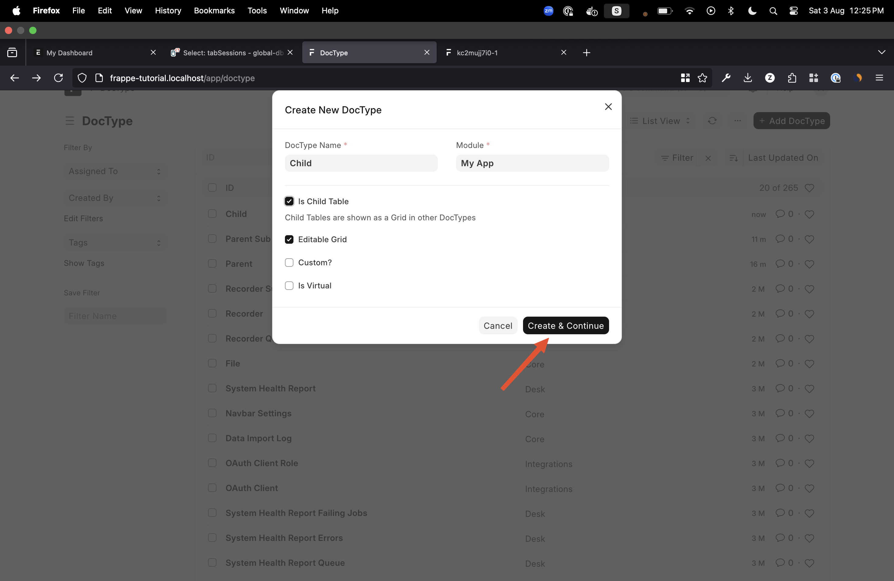
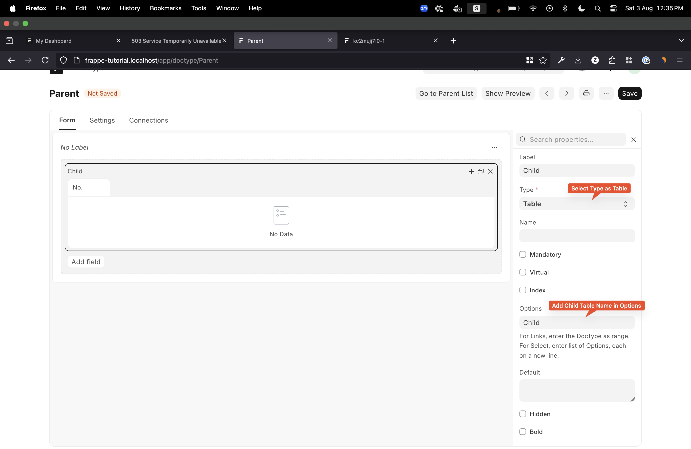
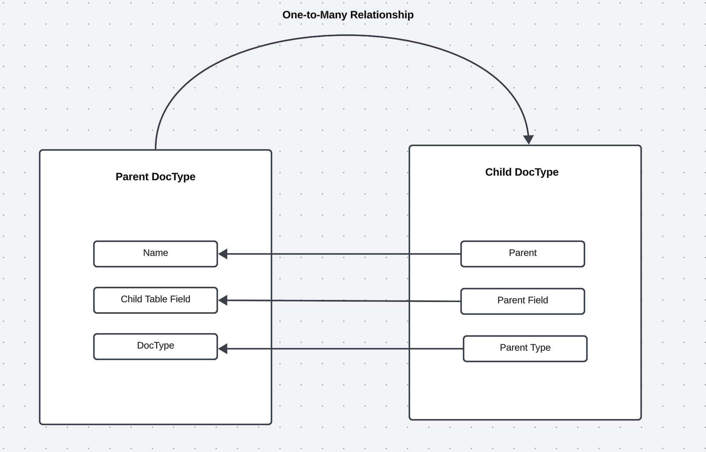
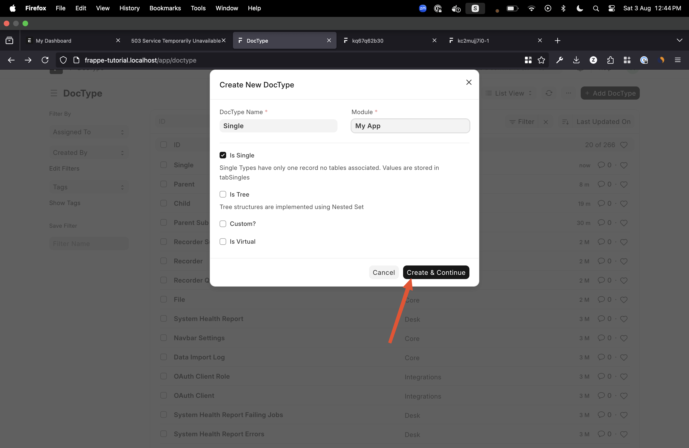

# Introduction To DocType

DocType in Frappe is used to store data in a structured manner. DocTypes can be mapped to database tables.

## Types of DocTypes

1. **Normal DocType**

   This is the most basic type of DocType in Frappe. Most of the time, we create a default DocType. You will need a DocType name and a Module to create this type of DocType.

   

   > `Is Submittable`: This option makes the DocType submittable if the value is true.

   

2. **Child DocType**

   Child tables are used to store data for a given Parent DocType. One child table can have multiple Parent DocTypes.

   This is how we can create a child table:

   

   This is how we add a Child table in a Parent DocType:

   

   This is how a child table makes the connection with the parent:

   

3. **Single DocType**

   Single DocTypes have only one record and no associated tables. Values are stored in `tabSingles`. All the App Settings page are made with given DocType.

   This is how we can create a Single DocType:

   

4. **Tree DocType**

   This type of DocType is used to create a tree structure in Frappe.

*Note*

- **Custom**: By default, every DocType will be standard, which means it will add the DocType file in the given Module selected. But if you just want to create a DocType at runtime and don't want to edit any file on the server, then we create a Custom DocType. The only difference is that it doesn't change anything in the file system, other uses are the same as other DocTypes in Frappe.

- **Virtual**: This type of DocType gives you full control over how you want to store the data. It doesn't create any database table like other DocTypes. You have to handle all operations with custom code. It can be useful when you want to perform some operations with files and also want to render that in the frontend without making database updates.